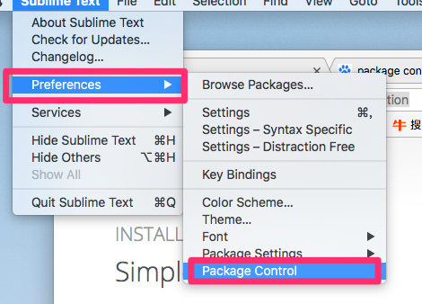

# 开发工具
## WebStorm2017
## ideaIU
## Xcode
[Apple相关下载](https://developer.apple.com/download/)
## AndroidStudio
[AndroidStudio下载](https://developer.android.com/studio/)
## SublimeText
#### 插件安装
**Package Control**
安装方法：
https://packagecontrol.io/installation
安装后可以从下图中点进去或者cmd+shift+p然后点击进去，搜索Package Controle,然后点击install搜索对应的插件即可


**Markdown Editing**
**MarkdownLivePreview**

# 效率工具
## Hexo
[官网](https://hexo.io/zh-cn/index.html)
```
npm install hexo-cli -g
hexo init blog
cd blog
npm install
hexo server
```
[theme插件](https://github.com/litten/hexo-theme-yilia)

# Mac系统工具
##  iTerm2
[官网](https://www.iterm2.com/)
[iTerm2&ohmyzsh的经验](https://xiaozhou.net/learn-the-command-line-iterm-and-zsh-2017-06-23.html)
## oh-my-zsh
[官网](https://ohmyz.sh/)

## gotoshell
[下载及使用](http://zipzapmac.com/go2shell)
**配置**


## 圈点
[下载及使用](https://evernote.com/intl/zh-cn/products/skitch)
# 资料
## markdown相关
[markdown-cheatsheet](../assets/markdown-cheatsheet.pdf)


